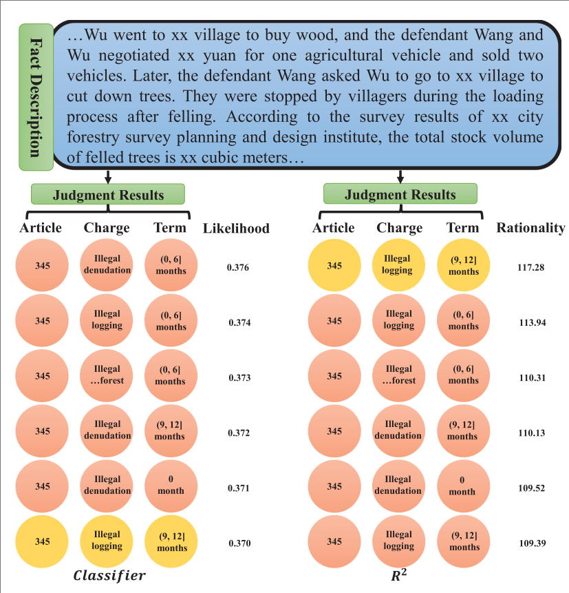

<h1>R<sup>2</sup></h1>

Official implementation for TALSP 2024 paper: "**[R<sup>2</sup>: A Novel Recall & Ranking Framework for Legal Judgment Prediction](https://ieeexplore.ieee.org/document/10439618)**"


 <div>
    <a href="https://yuquanle.github.io/RR-homepage/"></a> <a href="https://ieeexplore.ieee.org/document/10439618">
  
</a>


   </div>

<h5> If you like this work, please give us a star ⭐ on GitHub.  </h2>


<h1>Introduction</h1> 
</div>

 <br>

</h5>
</p> 
<p align="center">
    
<p>
    <p align="justify"> The legal judgment prediction (LJP) task is to automatically decide appropriate law articles, charges, and term of penalty for giving the fact description of a law case. It considerably influences many real legal applications and has thus attracted the attention of legal practitioners and AI researchers in recent years. In real scenarios, many confusing charges are encountered, makes LJP challenging. Intuitively, for a controversial legal case,
legal practitioners usually first obtain various possible judgment results as candidates based on the fact description of the case; then these candidates generally need to be carefully considered based on the facts and the rationality of the candidates. Inspired by this observation, this paper presents a novel Recall & Ranking framework, dubbed as R2, which attempts to formalize LJP as a two-stage problem. The recall stage is designed to collect high-likelihood judgment results for a given case; these results are regarded as candidates for the ranking stage. The ranking
stage introduces a verification technique to learn the relationships between the fact description and the candidates. It treats the partially correct candidates as semi-negative samples, and thus has a certain ability to distinguish confusing candidates. Moreover, we devise a comprehensive judgment strategy to refine the final judgment results by comprehensively considering the rationality of multiple probable candidates. We carry out numerous experiments
on two widely used benchmark datasets. The experimental results demonstrate our proposed approach’s effectiveness compared to the other competitive baselines.</p>


## Code Structure
```
Recall & Ranking framework/
├── checkpoint
├── dataset.py
├── main_classifier.py
├── main_verifier.py
├── model.py
├── pre_model
├── README.md
├── statistic_topk.py
├── train_classifier.py
├── train_test_verifier.py
└── utils.py
```

## Datasets
We use the following datasets:
- [CAIL-small, CAIL-big](https://cail.oss-cn-qingdao.aliyuncs.com/CAIL2018_ALL_DATA.zip)


### Data preprocessing
Following the settings of most existing studies, we perform the same preprocessing pipeline, whose code was published in [LADAN](https://github.com/prometheusXN/LADAN)
```shell
cd RR/datasets
./run_process.sh
```

## Quick Start

### Training.
```shell
git clone https://github.com/RR.git
cd RR
python -u train_classifier.py
python -u train_test_verifier.py
```

### Infering.
```shell
python -u main_classifier.py
python -u main_verifier.py
```

## Acknowledgement
The data-preprocessing code is drawn from open-source project ([LADAN](https://github.com/prometheusXN/LADAN)); we thank the authors for sharing their work.


## Citation
If you find this work useful, please consider starring 🌟 this repo and citing 📑 our paper:


```bibtex
@article{le2024boldsymbol,
  title={$$\backslash$boldsymbol $\{$R$\}$\^{}$\{$2$\}$ $: A Novel Recall \& Ranking Framework for Legal Judgment Prediction},
  author={Le, Yuquan and Quan, Zhe and Wang, Jiawei and Cao, Da and Li, Kenli},
  journal={IEEE/ACM Transactions on Audio, Speech, and Language Processing},
  volume={32},
  pages={1609--1622},
  year={2024},
  publisher={IEEE}
}
```
